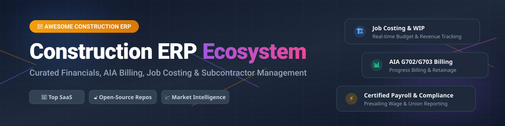

  

# 🏗️ Awesome Construction ERP Ecosystem 🚀

  
  
  
  
  

> **A comprehensive, SEO-optimized, curated guide to Construction ERP platforms, job costing engines, AIA progress billing systems, certified payroll software, and open-source construction accounting frameworks.**

---

## 📌 Overview & Scope

Modern **Construction Enterprise Resource Planning (ERP)** software forms the financial and operational backbone of general contractors, specialty subcontractors, heavy civil builders, and engineering firms. Unlike generic corporate ERPs, construction-specific solutions strictly integrate **Job Costing**, **Work-in-Progress (WIP) Reporting**, **AIA G702/G703 Progress Billing**, **Retainage Management**, **Equipment Cost Tracking**, and **Certified Prevailing Wage Payroll**.

Whether you are evaluating commercial cloud ERP suites or building self-hosted modular stacks using open-source tools, this repository provides deep comparative market data, pricing transparency, and repository metrics.

---

## 📊 Market Intelligence & Dynamics

> 💡 **Market Size & Structure:**  
> The global Construction ERP & Management Software market size is estimated at **$10.5 Billion in 2026** and is projected to reach **$16.8 Billion by 2031**, growing at a CAGR of ~9.8%.  
> The sector is **moderately fragmented**. While legacy giants (Trimble, Sage, Deltek, Constellation Software) control significant enterprise share, cloud-native challengers (Acumatica, CMiC, Premier) and customizable open-source frameworks (ERPNext, Odoo) prevent a single "winner-take-all" outcome, offering high competition across mid-market and specialty trade verticals.

---

## 💼 SaaS / Hosted Construction ERP Platforms

Below is a tabular analysis of leading commercial Construction ERP platforms, sorted by estimated company revenue/valuation in descending order.

| 🏢 Platform | 🔗 Link & Overview | 💲 Starting Pricing | 🎁 Free Tier / Trial Limit | 📈 Valuation / Revenue |
| :--- | :--- | :--- | :--- | :--- |
| **Sage Intacct Construction** | [Sage Intacct](https://www.sage.com/) Cloud-native financial ERP with job costing, WIP, and field integrations. | Starts at ~$9,000 – $12,000 / year (base subscription) | No free tier. 30-day interactive guided demo / trial available upon request. | **$12.0 Billion** valuation (Sage Group plc public market cap) |
| **Trimble Viewpoint (Vista & Spectrum)** | [Viewpoint Vista](https://www.viewpoint.com/) Enterprise construction ERP connecting financials, job costing, operations, and payroll. | Custom quotes (typical enterprise contracts start at $15,000+ / year) | No free tier or public self-service trial. 1-on-1 custom sales demo available. | **$13.8 Billion** market cap (Trimble Inc. parent valuation) |
| **Deltek ComputerEase** | [Deltek ComputerEase](https://www.deltek.com/) Construction accounting & job costing software tailored for specialty contractors. | Starts at ~$5,000 / year base license + module add-ons | No free tier. Custom product demo offered on request. | **$3.0 Billion+** parent valuation (Deltek / Roper Technologies) |
| **Acumatica Construction Edition** | [Acumatica](https://www.acumatica.com/) Cloud ERP tailored for general contractors with consumption-based pricing. | Starts at ~$25,000 / year (scale-based consumption pricing) | No free tier. 14-day cloud sandbox trial available for partners/prospects. | **$2.0 Billion** valuation (Acquired by Vista Equity Partners) |
| **Jonas Premier Construction Software** | [Premier ERP](https://www.premierconstructionsoftware.com/) All-in-one cloud ERP for general contractors and land developers. | Starts at ~$125 – $349 / user / month | No free tier. 14-day structured software demo/trial upon request. | **$1.5 Billion+** segment value (Constellation Software / Jonas division) |
| **Foundation Software** | [Foundation](https://www.foundationsoft.com/) Construction accounting, job cost, and certified payroll for mid-market contractors. | Starts at ~$1,200 – $2,500 / month | No free tier. On-demand guided demo available. | **$800 Million** estimated private valuation |
| **CMiC** | [CMiC Global](https://cmicglobal.com/) Single-database enterprise ERP covering heavy civil and complex construction projects. | Custom enterprise quotes (typically $30,000+ / year) | No free tier or self-service trial. Personalized enterprise demo upon request. | **$500 Million** estimated private valuation |

---

## 🔓 Open-Source GitHub Projects

Explore proven open-source ERP systems, framework bases, and construction-specific management tools. Sorted by GitHub star count in descending order.

| 📦 Project | 🔗 Repository | ⭐ GitHub Stars Badge | 🛠️ Focus & Construction Capabilities |
| :--- | :--- | :--- | :--- |
| **Odoo Community** | [odoo/odoo](https://github.com/odoo/odoo) |  | Modular open-source ERP. Extensible with construction apps for Project, Inventory, Accounting, and Field Service. |
| **ERPNext** | [frappe/erpnext](https://github.com/frappe/erpnext) |  | Enterprise open-source ERP with built-in Project, BOQ estimating, materials, subcontracts, and job-style costing. |
| **OpenProject** | [opf/openproject](https://github.com/opf/openproject) |  | Open-source project management suite featuring Gantt charts, resource planning, and construction project collaboration. |
| **Frappe Framework** | [frappe/frappe](https://github.com/frappe/frappe) |  | Low-code Python/JS framework powering ERPNext and custom construction management Doctypes. |
| **Dolibarr ERP CRM** | [dolibarr/dolibarr](https://github.com/dolibarr/dolibarr) |  | Flexible open-source ERP & CRM suite with strong project tracking, proposals, and contractor invoicing modules. |
| **OpenConstructionERP** | [datadrivenconstruction/OpenConstructionERP](https://github.com/datadrivenconstruction/OpenConstructionERP) |  | Specialized construction open framework supporting BIM 4D/5D modeling, CAD takeoff, BOQ, and tendering. |
| **Apache OFBiz** | [apache/ofbiz](https://github.com/apache/ofbiz) |  | Enterprise automation software framework for custom ERP, job accounting, asset maintenance, and inventory workflows. |
| **Tryton** | [tryton/tryton](https://github.com/tryton/tryton) |  | Modular 3-tier open-source business application platform suited for custom job costing ledgers. |
| **BuildSuite Core** | [BuildSuite-io/buildsuite_core](https://github.com/BuildSuite-io/buildsuite_core) |  | Open-source construction OS on Frappe—handles work packages, stage gates, and site governance. |

---

## 🛠️ Self-Hosted Architecture & Open-Source Stacks

For general contractors wanting data sovereignty without seat-license fees:
1. **Core Financials & Costing:** Deploy **ERPNext** or **Odoo Community** for general ledgers, AP/AR, purchasing, and job costing.
2. **Site Project Control:** Integrate **OpenProject** for site scheduling, Gantt milestones, and task tracking.
3. **BIM & Takeoff Tools:** Connect **OpenConstructionERP** for CAD 4D/5D cost modeling and BOQ generation.
4. **Custom Workflows:** Use **Frappe Framework** to construct custom AIA billing approval gates and safety incident logs.

---

## 🤝 How to Contribute

1. Fork this repository. 🍴
2. Create a feature branch (`git checkout -b feature/new-erp-entry`).
3. Add your entry to `README.md` following the tabular format above.
4. Open a Pull Request with a clear description of the project/platform.

---

## 📜 Disclaimer

*This list is community-curated for informational and educational purposes only. Construction accounting involves complex tax rules, certified prevailing wage compliance, and retainage laws. Always consult qualified CPAs or software architects prior to deployment.*

---

## 💖 Support & Acknowledgments

Thank you for exploring and contributing to the **Awesome Construction ERP** project! 🌟  
If you find this repository valuable, please consider:
- ⭐️ **Starring** this repository on GitHub to boost visibility.
- 🔀 **Forking** and sharing with fellow construction technologists & software architects.
- 💬 Joining our developer discussions on [Discord](https://discord.gg/jc4xtF58Ve).
- ☕ **Sponsoring the Maintainer:** Support ongoing curation and open-source tools by buying a coffee at the [GitHub Sponsor Dashboard](https://github.com/sponsors/ishandutta2007).

---

## 📈 Star History

---

  Curated with ❤️ for Construction CFOs, Controllers, and Open-Source ERP Advocates.

